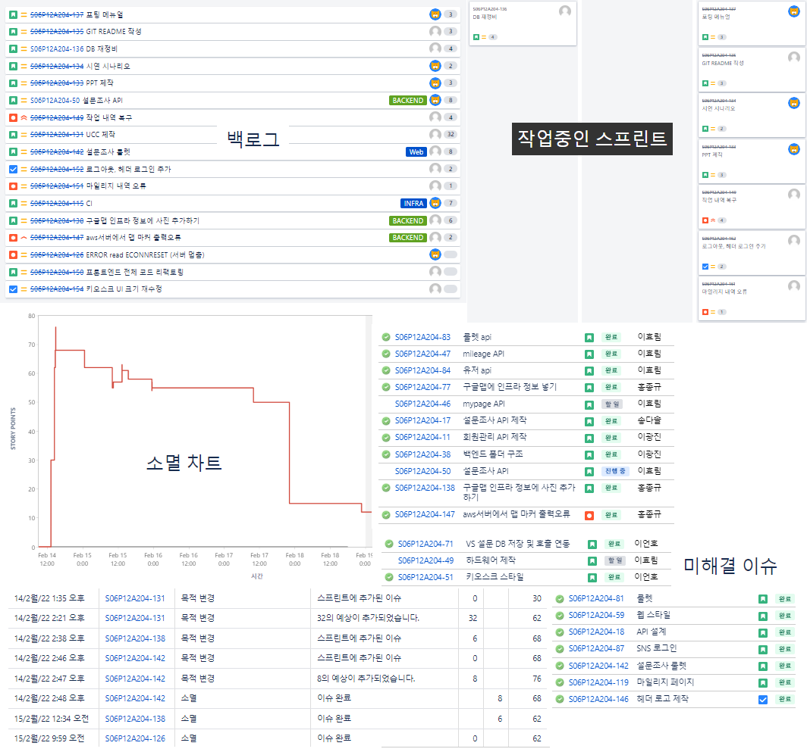
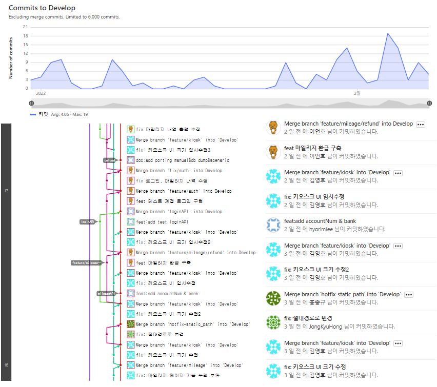
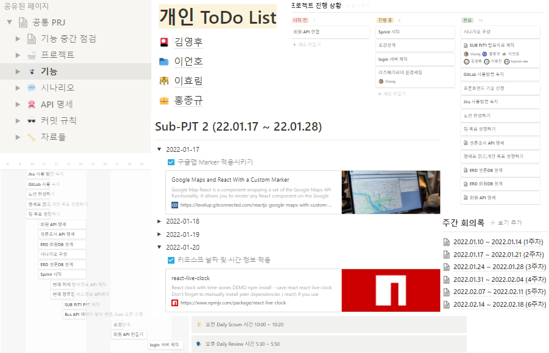
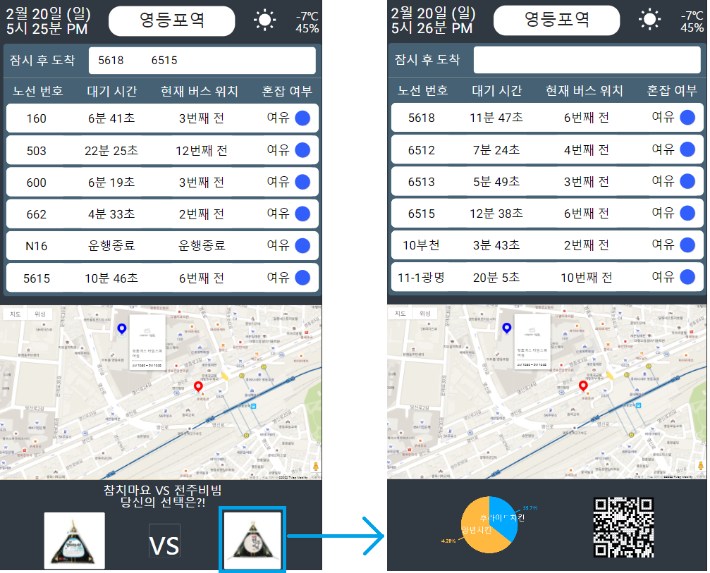
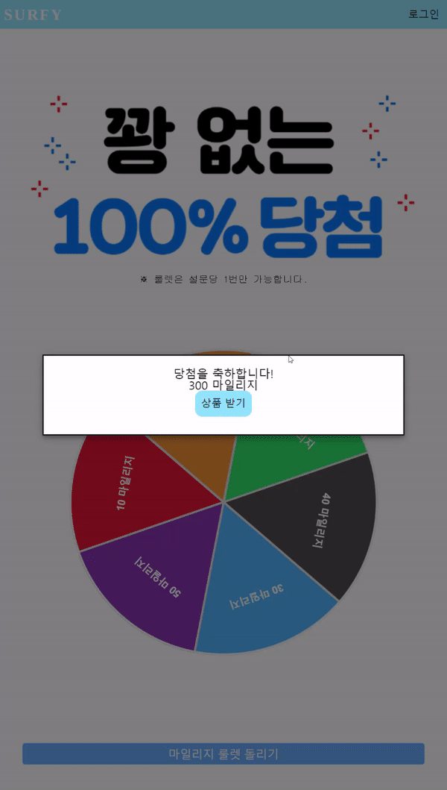
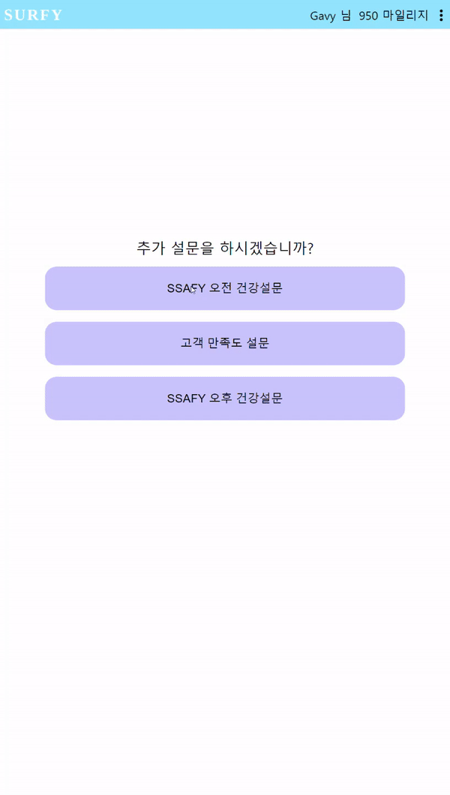

# 시선집중 (SURFY) 📲

- 프로젝트 기간 : 2022. 01. 04 ~ 2022. 02. 18 (약 7주)
- 자유롭게 설문을 할 수 있는 환경과 그에 대한 당첨 보상을 통해 키오스크에 대한 관심도 상승
- 사람들이 많이 모이는 버스 정류장의 키오스크를 활용한 설문조사 플랫폼
- 키오스크 내 QR코드를 활용하여 모바일 기기로 설문 조사 실시 후 당첨 마일리지 수령

&nbsp;

## 목차 📄 

##### ✔ 팀 멤버

##### ✔ 사용 기술

##### ✔ 프로젝트 진행 기록

##### ✔ 서비스 내용

##### ✔ 회고

&nbsp;

## 팀 구성 👨‍👩‍👧‍👧 

| 멤버 이름     | 멤버 역할                   | 개발 내용                                                    |
| ------------- | :-------------------------- | ------------------------------------------------------------ |
| 이효림 (팀장) | Backend, Hardware, CI/CD    | 전체 DB 설계, 서버구축, 회원관리, 로그인 DB관리, 배포 및 키오스크 연동 |
| 이언호 (팀원) | Frontend, Jira관리, UCC제작 | 버스정보/설문/마일리지/로그인 API 연동, 소셜로그인, 마일리지 적립/출금 기능 DB저장(FE) |
| 홍종규 (팀원) | Frontend, Backend 보조      | 날씨API연동, 설문/마일리지 DB관리, 추가설문 페이지 기능 구현, 마일리지 적립/출금 기능 DB저장(BE) |
| 김영후 (팀원) | Frontend, Git, UI/UX 디자인 | 구글맵API연동, 키오스크/웹 페이지 UI/UX 디자인, 룰렛/마일리지 적립/출금 기능 구현 |

&nbsp;

## 사용 기술 🖱 

&nbsp;&nbsp;&nbsp;&nbsp;&nbsp;&nbsp;

&nbsp;

## 프로젝트 진행 기록 ✏

- #### Jira

  - 백로그와 이슈, 스프린트 관리 및 소멸차트 기록

  

  &nbsp;

- #### Git

  - 커밋 규칙과 브랜치를 통한 협업 내용 

  

  &nbsp;

- #### Notion

  - 노션을 통해 매일 회의 내용과 개발 내용 및 계획 기록

  

&nbsp;

## 서비스 내용 👐

- #### 키오스크 화면
  
  - 버스정류장에 설치될 키오스크 화면입니다.
  - 날짜, 시간, 현재 정류장 위치와 날씨 정보, 실시간 버스 정보를 확인할 수 있으며, 지도에 터치를 하면 주변 인프라와 건물 정보를 확인할 수 있습니다.
  - 하단에 vs설문은 버스를 기다리는 사람들의 심심함을 해소하면서 동시에 키오스크에 대한 관심도를 올리기 위해 구성하였으며, 원하는 이미지를 선택하면 통계 지표와 함께 QR코드르 화면으로 넘어갈 수 있습니다.

&nbsp;

- #### 모바일 화면

  - ##### 룰렛 페이지

    - 키오스크 화면 하단의 QR코드 스캔을 하면 룰렛 페이지로 이동됩니다.
    - 룰렛을 돌리면 6가지 당첨 마일리지중 하나가 당첨됩니다.
  
    
  
    &nbsp;
  
  - ##### 로그인 창
  
    - 마일리지를 수령하기 위해서는 로그인이 필요합니다.
    - 이용자의 편의를 위해 회원가입이 아닌 소셜 로그인을 통해 이용할 수 있습니다.

    

  &nbsp;

  - ##### 추가 설문 페이지
  
    - 로그인 후 추가 설문을 할 수 있습니다.
    - 추가 설문을 완료하면 룰렛의 기회가 주어지며, 이미 완료한 설문은 더 하실 수 없습니다.
  
    
  
  &nbsp;
  
  - ##### 마일리지 적립 페이지
  
    - 설문 후 적립한 마일리지에 대해 내역을 확인할 수 있습니다.
  
    
  
  &nbsp;
  
  - ##### 마일리지 환급 페이지
  
    - 적립된 마일리지를 본인의 계좌로 출금할 수 있으며, 출금 후 마일리지 내역 페이지에서 출금 내역을 확인할 수 있습니다.
  
    

&nbsp;

## 회고 💭

#### 😃 배운 점 🧡

✔ 프로젝트를 하면서 처음으로 Git, Jira를 활용하였다.

✔ React를 공부하는 계기가 되었고, Material-UI와 Styled-Components를 공부하였다.

✔ Jira 활용법을 배웠다. (Epic, Story, Subtask)

✔ 페이지 마다 UI를 작업하다 보니, CSS 역량이 향상됐다.

&nbsp;

#### 😫 힘들거나 아쉬운 점 💧

✔ React를 처음 공부하면서 프로젝트를 진행하다 보니, 개발 속도가 느렸다.

✔ Git Branch를 사용하면서 충돌 발생이 잦았다.

✔ 프로젝트 중간에 2명의 팀원이 취업으로 인해 이탈하여 역할이 늘어났다. 

&nbsp;

#### 🤔 개선할 점 🔥

✔ Git에 대해 좀 더 공부하여 충돌을 일으키지 않고, 발생했다면 원인을 찾고 바로 해결해야 한다.

✔ 프로젝트 과정에서 배운 내용은 바로바로 문서화를 해야한다.

✔ UI/UX 측면에서 고민을 많이 해야할 것 같다.

&nbsp;
